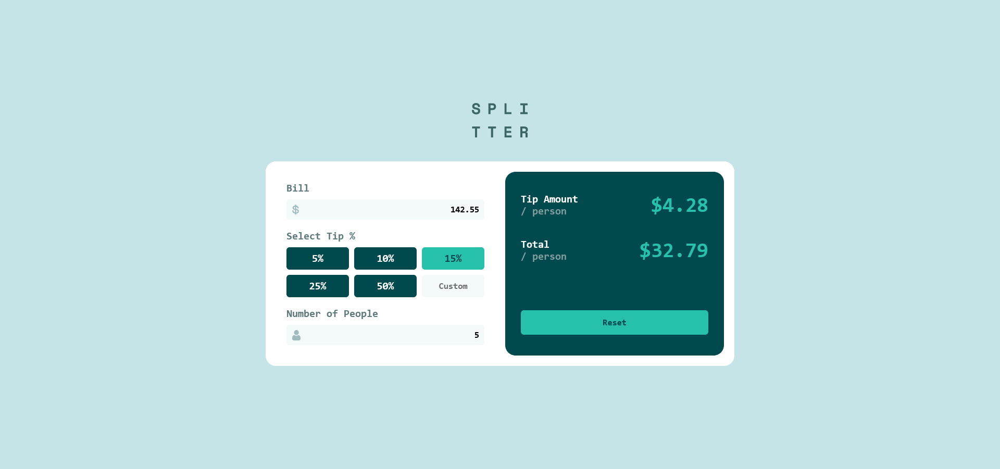
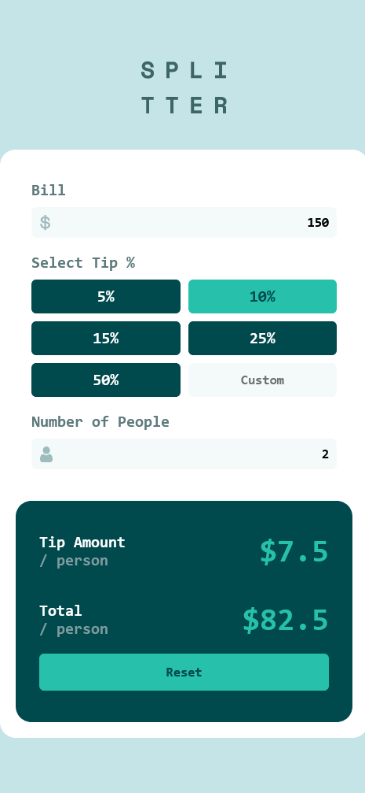

# Frontend Mentor - Tip calculator app solution

This is a solution to the [Tip calculator app challenge on Frontend Mentor](https://www.frontendmentor.io/challenges/tip-calculator-app-ugJNGbJUX). Frontend Mentor challenges help you improve your coding skills by building realistic projects.

## Overview

### The challenge

Users should be able to:

- View the optimal layout for the app depending on their device's screen size
- See hover states for all interactive elements on the page
- Calculate the correct tip and total cost of the bill per person

### Screenshots

### Links

- Solution URL: [Here](https://github.com/CristianB13/tip-calculator-app)
- Live Site URL: [Here](https://tip-calculator-app-13.netlify.app/)

### Built with

- Semantic HTML5 markup
- CSS custom properties
- Flexbox
- CSS Grid
- [Angular](https://angular.io/) - Web framework

### Useful resources

- [Reactive Forms](https://angular.io/guide/reactive-forms)
- [Reactive Forms Youtube Tutorial](https://www.youtube.com/watch?v=JeeUY6WaXiA)